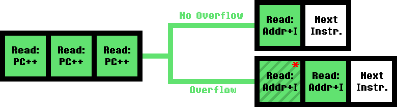

[<< Back to Last Page](../)

# The CPU

After getting a basic memory and ROM loading system into place, the next step is usually emulating the CPU. The following section is going to elaborate on the basic way a CPU operates, but if you've already written an emulator before, chances are you'll already know most of it, so you can safely skip it.

## Basic Operation Concept

The basic idea of a usual CPU structure can be summarized in three steps, commonly referred to as "Fetch - Decode - Execute". During the first step, "Fetch", the CPU reads a value from memory. This value is called an "Opcode" and is intended to tell the CPU what exactly it should be doing. Each opcode has an associated "instruction", such as loading values from memory, storing them in memory, adding values together, etc. Determining which instruction should be run based on the Opcode is the "Decode" step. And, finally, the decoded instruction is executed in the final step.

In order to keep track of where in memory the CPU should read opcodes from an internal register named "Program Counter" (usually abbreviated to PC) is used. It simply stores the memory address the next opcode should be read from, and is incremented on every read. Some instructions, such as jump instructions, can also directly write to this register, making the CPU "jump" between code segments that are being executed. (Hence the name of the instruction)

Additionally, most processors have the capability of keeping a Stack. In practice this is simply just another register, named "Stack Pointer" (usually abbreviated to SP), which keeps track of a memory address. When data is "pushed" (or "written") to the stack, it's written to the address the stack pointer is pointing to, followed by the stack pointer being decremented. Data can be "popped" (or "read") from the stack as well by doing the same thing in reverse - first increment the stack pointer, then read the value at the resulting address. This is most commonly used for "subroutines" - sections of code that are separate from the "main line" of code. For example, the main code section could call a subroutine - this pushes the address of where the call operation occurred to the stack. Next the CPU jumps to the subroutine and executes it until it hits a return instruction, which makes the CPU pop the address off the stack and jump back to it, so that the main code can resume execution.

## The NES CPU - An Overview

The processor used in the NES is a variant of the 6502 processor. Compared to CPUs like the Gameboy's SM83 it's quite compact in terms of supported instructions, however, each of these instructions has a large amount of different "addressing modes" (determining where in memory the value which an instruction should be executed on is read from).

Additionally, the CPU is in a slightly unusual relationship with memory, in that every single clock cycle either a read or a write operation is performed. This causes certain timing quirks with certain instructions, as memory may be read from or written to unexpectedly.

### Registers

The following table gives a short overview of the data registers present in the CPU:

| **Name**               | **Size**     | **Description**                                              |
| ---------------------- | ------------ | ------------------------------------------------------------ |
| Accumulator (`A`)      | 8 bit        | The Accumulator register is the main register for all instructions that involve arithmetic or bitwise operations. |
| Indexes (`X` & `Y`)    | 8 bit (each) | The X and Y registers can be used to offset memory accesses with certain addressing modes or simply act as additional data storage. |
| Status (`P`)           | 8 bit        | The Status Register contains bitflags which are set or reset depending on certain conditions when an instruction is executed (such as overflow on addition, etc.) |
| Program Counter (`PC`) | 16 bit       | The Program Counter keeps track of the memory address the next instruction is to be fetched from. |
| Stack Pointer (`S`)    | 8 bit        | The Stack Pointer keeps track of the lower boundary of the stack and is used by instructions that involve pushing data to or popping data from the stack. |

#### The Status Register

The following image is a visualization of the Status Register P and the names for each section of bits within it:

* **[C] Carry:** This flag is usually used by arithmetic instructions to represent whether a carry resulted from the operation, as well as bit shift instructions.
* **[Z] Zero:** Almost all instructions set this flag if the result of the performed operation is zero, otherwise it is reset.
* **[I] Interrupt Disable:** If this flag is set, no CPU Interrupts (aside from NMIs) can occur. This is negligible for emulators early on in development.
* **[D] Decimal:** This flag is a leftover from the original 6502 CPU and has no effect, as the NES variant is lacking Decimal mode functionality.
* **[V] Overflow:** Set by arithmetic instruction if an overflow occurs or by the `BIT` instruction.
* **[N] Negative:** Almost all instructions set this flag to the same value as bit 7 of the result of the instruction.
* **[B] The B Flag:** The B flag is technically not part of the Status Register itself, but rather additional data which is added when the register is pushed to the stack. Bit 5 is always 1, the value of bit 4 depends on how the register was pushed. If it was pushed as the result of a `PHP` or `BRK` instruction, it is set to `1`, if it was pushed as the result of an interrupt or an NMI, it is set to `0`. Emulating the behaviour of the `PHP` instruction is recommended for early CPU development, as the `nestest` ROM commonly used for debugging depends on it.

## The Instruction Set

For a complete and easy-to-understand summary of all instructions and how they operate, check out [this website.](http://obelisk.me.uk/6502/reference.html) It describes the effects each instruction has on the status register, as well as the amount of CPU cycles each instruction (depending on the addressing mode used) takes. Refer to the following sections for in-depth descriptions and diagrams of timings for various types of instructions. (This information is taken from [the 6502_cpu.txt document](http://nesdev.com/6502_cpu.txt))

### Terminology

Due to the property of each CPU cycle being either a read from or write to memory, "dummy operations" can occur while the CPU is processing a cycle where memory accesses aren't required. These are referred to as "dummy reads" and "dummy writes" and may be used by games and mappers for timing purposes.

Refer to the following image for reference on the meaning of the color-coded tiles in the following timing diagrams:

### Quick Reference

- [Accumulator & Implied Addressing](#accumulator--implied-addressing)
- [Immediate Addressing](#immediate-addressing)
- **Absolute Addressing:**
  - [Read Instructions](#absolute-addressing---read-instructions)
  - [Write Instructions](#absolute-addressing---write-instructions)
  - [Read-Modify-Write Instructions](#absolute-addressing---read-modify-write-instructions)
- **Zero Page Addressing:**
  - [Read Instructions](#zero-page-addressing---read-instructions)
  - [Write Instructions](#zero-page-addressing---write-instructions)
  - [Read-Modify-Write Instructions](#zero-page-addressing---read-modify-write-instructions)
- **Zero Page Indexed Addressing:**
  - [Read Instructions](#zero-page-indexed-addressing---read-instructions)
  - [Write Instructions](#zero-page-indexed-addressing---write-instructions)
  - [Read-Modify-Write Instructions](#zero-page-indexed-addressing---read-modify-write-instructions)
- **Absolute Indexed Addressing:**
  - [Read Instructions](#absolute-indexed-addressing---read-instructions)
  - [Write Instructions](#absolute-indexed-addressing---write-instructions)
  - [Read-Modify-Write Instructions](#absolute-indexed-addressing---read-modify-write-instructions)
- **Indexed Indirect Addressing:**
  - [Read Instructions](#indexed-indirect-addressing---read-instructions)
  - [Write Instructions](#indexed-indirect-addressing---write-instructions)
  - [Read-Modify-Write Instructions](#indexed-indirect-addressing---read-modify-write-instructions)

### Accumulator & Implied Addressing

This applies to the following instructions: `ASL, CLC, CLD, CLI, CLV, DEX, DEY, INX, INY, LSR, NOP, ROL, ROR, SEC, SED, SEI, TAX, TAY, TSX, TXA, TXS, TYA`

The Accumulator / Implied Addressing variants of the instructions listed above each take 2 CPU cycles:

* **Cycle 1:** The opcode is fetched from the address stored in PC and PC is incremented by 1.
* **Cycle 2:** The operation is performed on the target register (`NOP` idles during this cycle). A dummy read occurs on the address stored in PC, but PC is not incremented.

**Timing Diagram:**

### Immediate Addressing

This applies to the following instructions: `ADC, AND, CMP, CPX, CPY, EOR, LDA, LDX, LDY, ORA, SBC`

The Immediate Addressing variants of the instructions listed above each take 2 CPU cycles:

* **Cycle 1:** The opcode is fetched from the address stored in PC and PC is incremented by 1.
* **Cycle 2:** The next byte after the opcode is read using the address stored in PC and PC is incremented by 1. The operation is performed on the target register during the same cycle.

**Timing Diagram:**

### Absolute Addressing - Read Instructions

This applies to the following instructions: `LDA, LDX, LDY, EOR, AND, ORA, ADC, SBC, CMP, BIT, LAX, NOP`

The Absolute Addressing variants of the instructions listed above each take 4 CPU cycles:

* **Cycle 1:** The opcode is fetched from the address stored in PC and PC is incremented by 1.
* **Cycle 2:** The low byte of the source address is fetched from the address stored in PC and PC is incremented by 1.
* **Cycle 3:** The high byte of the source address is fetched from the address stored in PC and PC is incremented by 1.
* **Cycle 4:** The operation is performed on the target register using the value read from the memory address fetched in the previous 2 cycles.

**Timing Diagram:**

### Absolute Addressing - Write Instructions

This applies to the following instructions: `STA, STX, STY, SAX`

The Absolute Addressing variants of the instructions listed above each take 4 CPU cycles:

* **Cycle 1:** The opcode is fetched from the address stored in PC and PC is incremented by 1.
* **Cycle 2:** The low byte of the source address is fetched from the address stored in PC and PC is incremented by 1.
* **Cycle 3:** The high byte of the source address is fetched from the address stored in PC and PC is incremented by 1.
* **Cycle 4:** The value is written to the memory address fetched in the previous 2 cycles.

**Timing Diagram:**

### Absolute Addressing - Read-Modify-Write Instructions

This applies to the following instructions: `ASL, LSR, ROL, ROR, INC, DEC, SLO, SRE, RLA, RRA, ISB, DCP`

The Absolute Addressing variants of the instructions listed above each take 6 CPU cycles:

* **Cycle 1:** The opcode is fetched from the address stored in PC and PC is incremented by 1.
* **Cycle 2:** The low byte of the source address is fetched from the address stored in PC and PC is incremented by 1.
* **Cycle 3:** The high byte of the source address is fetched from the address stored in PC and PC is incremented by 1.
* **Cycle 4:** The value at the memory address fetched in the previous 2 cycles is read and temporarily buffered.
* **Cycle 5:** The value fetched in the previous cycle is dummy-written to the memory address fetched in cycles 2 & 3. Afterwards, the operation is performed on the value and the result is buffered.
* **Cycle 6:** The result value is written to the memory address fetched in cycles 2 & 3.

**Timing Diagram:**

### Zero Page Addressing - Read Instructions

This applies to the following instructions: `LDA, LDX, LDY, EOR, AND, ORA, ADC, SBC, CMP, BIT, LAX, NOP`

The Zero Page Addressing variants of the instructions listed above each take 3 CPU cycles:

* **Cycle 1:** The opcode is fetched from the address stored in PC and PC is incremented by 1.
* **Cycle 2:** The byte after the opcode is fetched from the address stored in PC and PC is incremented by 1.
* **Cycle 3:** The byte fetched in the previous cycle is used as the lower byte of the memory address while the high byte is set to `$00`. The operation is performed on the target register using the value read from this address.

**Timing Diagram:**

### Zero Page Addressing - Write Instructions

This applies to the following instructions: `STA, STX, STY, SAX`

The Zero Page Addressing variants of the instructions listed above each take 3 CPU cycles:

* **Cycle 1:** The opcode is fetched from the address stored in PC and PC is incremented by 1.
* **Cycle 2:** The byte after the opcode is fetched from the address stored in PC and PC is incremented by 1.
* **Cycle 3:** The byte fetched in the previous cycle is used as the lower byte of the memory address while the high byte is set to `$00`. The value is then written to this address.

**Timing Diagram:**

### Zero Page Addressing - Read-Modify-Write Instructions

This applies to the following instructions: `ASL, LSR, ROL, ROR, INC, DEC, SLO, SRE, RLA, RRA, ISB, DCP`

The Zero Page Addressing variants of the instructions listed above each take 5 CPU cycles:

* **Cycle 1:** The opcode is fetched from the address stored in PC and PC is incremented by 1.
* **Cycle 2:** The byte after the opcode is fetched from the address stored in PC and PC is incremented by 1.
* **Cycle 3:** The byte fetched in the previous cycle is used as the lower byte of the memory address while the high byte is set to `$00`. A value is read from this memory addressed and buffered.
* **Cycle 4:** The buffered value is dummy-written back to the address used in the previous cycle. Afterwards, the operation is performed on the value and the result is buffered.
* **Cycle 5:** The buffered result value is written to the address used in Cycle 3.

**Timing Diagram:**

### Zero Page Indexed Addressing - Read Instructions

This applies to the following instructions: `LDA, LDX, LDY, EOR, AND, ORA, ADC, SBC, CMP, BIT, LAX, NOP`

The Zero Page Indexed Addressing variants of the instructions listed above each take 4 CPU cycles:

* **Cycle 1:** The opcode is fetched from the address stored in PC and PC is incremented by 1.
* **Cycle 2:** The byte after the opcode is fetched from the address stored in PC and PC is incremented by 1.
* **Cycle 3:** The value at the memory address fetched in the previous cycle (with the upper byte set to `$00`) is dummy-read. Afterwards, the value of the index register (X or Y, depending on the instruction) is added to the address and buffered. This is done within the boundaries of 8 bit values, so the result is effectively ANDed with `$FF`.
* **Cycle 4:** The operation is performed on the target register using the value read from the memory address determined in the previous cycle.

**Timing Diagram:**

(`I` in the diagram above represents the value of the index register used to offset the given address)

### Zero Page Indexed Addressing - Write Instructions

This applies to the following instructions: `STA, STX, STY, SAX`

The Zero Page Indexed Addressing variants of the instructions listed above each take 4 CPU cycles:

* **Cycle 1:** The opcode is fetched from the address stored in PC and PC is incremented by 1.
* **Cycle 2:** The byte after the opcode is fetched from the address stored in PC and PC is incremented by 1.
* **Cycle 3:** The value at the memory address fetched in the previous cycle (with the upper byte set to `$00`) is dummy-read. Afterwards, the value of the index register (X or Y, depending on the instruction) is added to the address and buffered. This is done within the boundaries of 8 bit values, so the result is effectively ANDed with `$FF`.
* **Cycle 4:** The value is written to the memory address determined in the previous cycle.

**Timing Diagram:**

(`I` in the diagram above represents the value of the index register used to offset the given address)

### Zero Page Indexed Addressing - Read-Modify-Write Instructions

This applies to the following instructions: `ASL, LSR, ROL, ROR, INC, DEC, SLO, SRE, RLA, RRA, ISB, DCP`

The Zero Page Addressing variants of the instructions listed above each take 6 CPU cycles:

* **Cycle 1:** The opcode is fetched from the address stored in PC and PC is incremented by 1.
* **Cycle 2:** The byte after the opcode is fetched from the address stored in PC and PC is incremented by 1.
* **Cycle 3:** The value at the memory address fetched in the previous cycle (with the upper byte set to `$00`) is dummy-read. Afterwards, the value of the index register (X or Y, depending on the instruction) is added to the address and buffered. This is done within the boundaries of 8 bit values, so the result is effectively ANDed with `$FF`.
* **Cycle 4:** A value is read from the memory address determined in the previous cycle and buffered.
* **Cycle 5:** The buffered value is dummy-written to the memory address determined in cycle 3. Afterwards, the operation is performed on the buffered value and the result is once again buffered.
* **Cycle 6:** The buffered result value is written to the memory address determined in cycle 3.

**Timing Diagram:**

(`I` in the diagram above represents the value of the index register used to offset the given address)

### Absolute Indexed Addressing - Read Instructions

This applies to the following instructions: `LDA, LDX, LDY, EOR, AND, ORA, ADC, SBC, CMP, BIT, LAX, LAE, SHS, NOP`

The Absolute Indexed Addressing variants of the instructions listed above each take either 4 or 5 CPU cycles:

* **Cycle 1:** The opcode is fetched from the address stored in PC and PC is incremented by 1.
* **Cycle 2:** The low byte of the source address is fetched from the address stored in PC and PC is incremented by 1.
* **Cycle 3:** The high byte of the source address is fetched from the address stored in PC and PC is incremented by 1. Additionally, the value of the index register (X or Y, depending on the instruction) is added to the low byte of the address fetched in the previous cycle. The result is limited to 8 bits, so it is effectively ANDed with `$FF`, however, it is kept track of whether the addition overflowed.
* **Cycle 4:** A value is read from the memory address resulting from the combination of the high byte fetched in the previous cycle and the low byte calculated in the previous cycle. If an overflow occurred during the addition in the previous cycle, the high byte is incremented by 1 after this dummy-read occurs. Otherwise the operation is performed using the read value and the instruction ends at this cycle.
* **Cycle 5:** This cycle is only executed if the addition in cycle 3 caused an overflow. The low address byte calculated in cycle 3 is combined with the incremented high byte from the previous cycle and the value from the resulting memory address is read.

**Timing Diagram:**

(`I` in the diagram above represents the value of the index register used to offset the given address)

(`*` in the diagram above marks a read from an incorrect address due to the upper address byte not being adjusted to an overflow from the lower byte)

### Absolute Indexed Addressing - Write Instructions

This applies to the following instructions: `STA, STX, STY, SHA, SHX, SHY`

The Absolute Indexed Addressing variants of the instructions listed above each take 5 CPU cycles:

* **Cycle 1:** The opcode is fetched from the address stored in PC and PC is incremented by 1.
* **Cycle 2:** The low byte of the source address is fetched from the address stored in PC and PC is incremented by 1.
* **Cycle 3:** The high byte of the source address is fetched from the address stored in PC and PC is incremented by 1. Additionally, the value of the index register (X or Y, depending on the instruction) is added to the low byte of the address fetched in the previous cycle. The result is limited to 8 bits, so it is effectively ANDed with `$FF`, however, it is kept track of whether the addition overflowed.
* **Cycle 4:** A value is dummy-read from the memory address resulting from the combination of the high byte fetched in the previous cycle and the low byte calculated in the previous cycle. If an overflow occurred during the addition in the previous cycle, the high byte is incremented by 1 after this dummy-read occurs.
* **Cycle 5:** The value is written to the adjusted memory address determined in the previous cycle.

**Timing Diagram:**

(`I` in the diagram above represents the value of the index register used to offset the given address)

(`*` in the diagram above marks a read from a potentially incorrect address due to the upper address byte not being adjusted to an overflow from the lower byte)

### Absolute Indexed Addressing - Read-Modify-Write Instructions

This applies to the following instructions: `ASL, LSR, ROL, ROR, INC, DEC, SLO, SRE, RLA, RRA, ISB, DCP`

The Absolute Indexed Addressing variants of the instructions listed above each take 7 CPU cycles:

* **Cycle 1:** The opcode is fetched from the address stored in PC and PC is incremented by 1.
* **Cycle 2:** The low byte of the source address is fetched from the address stored in PC and PC is incremented by 1.
* **Cycle 3:** The high byte of the source address is fetched from the address stored in PC and PC is incremented by 1. Additionally, the value of the index register (X or Y, depending on the instruction) is added to the low byte of the address fetched in the previous cycle. The result is limited to 8 bits, so it is effectively ANDed with `$FF`, however, it is kept track of whether the addition overflowed.
* **Cycle 4:** A value is dummy-read from the memory address resulting from the combination of the high byte fetched in the previous cycle and the low byte calculated in the previous cycle. If an overflow occurred during the addition in the previous cycle, the high byte is incremented by 1 after this dummy-read occurs.
* **Cycle 5:** A value is read from the adjusted memory address determined in the previous cycle and buffered.
* **Cycle 6:** The originally read value is dummy-written to the same memory address as in the previous cycle. Afterwards, the operation is performed on the buffered value and the result is buffered.
* **Cycle 7:** The resulting value is written to the memory address determined in cycle 4.

**Timing Diagram:**

(`I` in the diagram above represents the value of the index register used to offset the given address)

(`*` in the diagram above marks a read from a potentially incorrect address due to the upper address byte not being adjusted to an overflow from the lower byte)

### Indexed Indirect Addressing - Read Instructions

This applies to the following instructions: `LDA, ORA, EOR, AND, ADC, CMP, SBC, LAX`

The Indexed Indirect Addressing variants of the instructions listed above each take 6 CPU cycles:

* **Cycle 1:** The opcode is fetched from the address stored in PC and PC is incremented by 1.
* **Cycle 2:** The byte after the opcode is fetched from the address stored in PC and PC is incremented by 1.
* **Cycle 3:** The byte fetched in the previous cycle is used as the low address byte while the high byte is set to 0. A dummy read occurs on the resulting memory address. After the read occurs, the value of the index register (X or Y, depending on the instruction) is added to the address. The result is limited to 8 bits, so it is effectively ANDed with `$FF`.
* **Cycle 4:** The value at the address calculated in the previous cycle is read and buffered. The address is incremented, but still limited to 8 bits, so it is effectively ANDed with `$FF`.
* **Cycle 5:** The value at the incremented address from the previous cycle is read and buffered as the upper byte of a new address, while the value read in the previous cycle represents the lower byte.
* **Cycle 6:** The operation is performed on the target register using the value read from the memory address calculated in the previous cycle.

**Timing Diagram:**

(`I` in the diagram above represents the value of the index register used to offset the given address)

### Indexed Indirect Addressing - Write Instructions

This applies to the following instructions: `STA, SAX`

The Indexed Indirect Addressing variants of the instructions listed above each take 6 CPU cycles:

* **Cycle 1:** The opcode is fetched from the address stored in PC and PC is incremented by 1.
* **Cycle 2:** The byte after the opcode is fetched from the address stored in PC and PC is incremented by 1.
* **Cycle 3:** The byte fetched in the previous cycle is used as the low address byte while the high byte is set to 0. A dummy read occurs on the resulting memory address. After the read occurs, the value of the index register (X or Y, depending on the instruction) is added to the address. The result is limited to 8 bits, so it is effectively ANDed with `$FF`.
* **Cycle 4:** The value at the address calculated in the previous cycle is read and buffered. The address is incremented, but still limited to 8 bits, so it is effectively ANDed with `$FF`.
* **Cycle 5:** The value at the incremented address from the previous cycle is read and buffered as the upper byte of a new address, while the value read in the previous cycle represents the lower byte.
* **Cycle 6:** The value is written to the memory address calculated in the previous cycle.

**Timing Diagram:**

(`I` in the diagram above represents the value of the index register used to offset the given address)

### Indexed Indirect Addressing - Read-Modify-Write Instructions

This applies to the following instructions: `SLO, SRE, RLA, RRA, ISB, DCP`

The Indexed Indirect Addressing variants of the instructions listed above each take 8 CPU cycles:

* **Cycle 1:** The opcode is fetched from the address stored in PC and PC is incremented by 1.
* **Cycle 2:** The byte after the opcode is fetched from the address stored in PC and PC is incremented by 1.
* **Cycle 3:** The byte fetched in the previous cycle is used as the low address byte while the high byte is set to 0. A dummy read occurs on the resulting memory address. After the read occurs, the value of the index register (X or Y, depending on the instruction) is added to the address. The result is limited to 8 bits, so it is effectively ANDed with `$FF`.
* **Cycle 4:** The value at the address calculated in the previous cycle is read and buffered. The address is incremented, but still limited to 8 bits, so it is effectively ANDed with `$FF`.
* **Cycle 5:** The value at the incremented address from the previous cycle is read and buffered as the upper byte of a new address, while the value read in the previous cycle represents the lower byte.
* **Cycle 6:** The value at the memory address calculated in the previous cycle is read and buffered.
* **Cycle 7:** The buffered value is dummy-written back to the same address as it was read from. Afterwards, the operation is performed on the buffered value and the result is buffered.
* **Cycle 8:** The resulting value is written to the memory address determined in cycle 5.

**Timing Diagram:**

(`I` in the diagram above represents the value of the index register used to offset the given address)

### Indirect Indexed Addressing - Read Instructions

This applies to the following instructions: `LDA, EOR, AND, ORA, ADC, SBC, CMP`

The Indirect Indexed Addressing variants of the instructions listed above each take either 5 or 6 CPU cycles:

* **Cycle 1:** The opcode is fetched from the address stored in PC and PC is incremented by 1.
* **Cycle 2:** The byte after the opcode is fetched from the address stored in PC and PC is incremented by 1.
* **Cycle 3:** The value at the memory address fetched in the previous cycle (with the upper byte set to `$00`) is read and buffered and the address is incremented. The result is limited to 8 bits, so it is effectively ANDed with `$FF`.
* **Cycle 4:** The value at the incremented address from the previous cycle is read and buffered. Afterwards, the value of the index register (X or Y, depending on the instruction) is added to the value read in the previous cycle. The result is limited to 8 bits, so it is effectively ANDed with `$FF`, however, it is kept track of whether the addition overflows.
* **Cycle 5:** A value is read from the memory address resulting from the combination of the high byte fetched in the previous cycle and the low byte calculated in the previous cycle. If an overflow occurred during the addition in the previous cycle, the high byte is incremented by 1 after this dummy-read occurs. Otherwise the operation is performed using the read value and the instruction ends at this cycle.
* **Cycle 6:** This cycle is only executed if the addition in cycle 4 caused an overflow. The low address byte calculated in cycle 4 is combined with the incremented high byte from the previous cycle and the value from the resulting memory address is read.

**Timing Diagram:**

(`I` in the diagram above represents the value of the index register used to offset the given address)

(`*` in the diagram above marks a read from an incorrect address due to the upper address byte not being adjusted to an overflow from the lower byte)

### Indirect Indexed Addressing - Write Instructions

This applies to the following instructions: `STA, SHA`

The Indirect Indexed Addressing variants of the instructions listed above each take 6 CPU cycles:

* **Cycle 1:** The opcode is fetched from the address stored in PC and PC is incremented by 1.
* **Cycle 2:** The byte after the opcode is fetched from the address stored in PC and PC is incremented by 1.
* **Cycle 3:** The value at the memory address fetched in the previous cycle (with the upper byte set to `$00`) is read and buffered and the address is incremented. The result is limited to 8 bits, so it is effectively ANDed with `$FF`.
* **Cycle 4:** The value at the incremented address from the previous cycle is read and buffered. Afterwards, the value of the index register (X or Y, depending on the instruction) is added to the value read in the previous cycle. The result is limited to 8 bits, so it is effectively ANDed with `$FF`, however, it is kept track of whether the addition overflows.
* **Cycle 5:** A value is dummy-read from the memory address resulting from the combination of the high byte fetched in the previous cycle and the low byte calculated in the previous cycle. If an overflow occurred during the addition in the previous cycle, the high byte is incremented by 1 after this dummy-read occurs.
* **Cycle 6:** The value is written to the memory address resulting from the combination of the high byte calculated in the previous cycle and the low byte calculated in cycle 4.

**Timing Diagram:**

(`I` in the diagram above represents the value of the index register used to offset the given address)

(`*` in the diagram above marks a read from a potentially incorrect address due to the upper address byte not being adjusted to an overflow from the lower byte)

### Indirect Indexed Addressing - Read-Modify-Write Instructions

This applies to the following instructions: `SLO, SRE, RLA, RRA, ISB, DCP`

The Indirect Indexed Addressing variants of the instructions listed above each take 8 CPU cycles:

* **Cycle 1:** The opcode is fetched from the address stored in PC and PC is incremented by 1.
* **Cycle 2:** The byte after the opcode is fetched from the address stored in PC and PC is incremented by 1.
* **Cycle 3:** The value at the memory address fetched in the previous cycle (with the upper byte set to `$00`) is read and buffered and the address is incremented. The result is limited to 8 bits, so it is effectively ANDed with `$FF`.
* **Cycle 4:** The value at the incremented address from the previous cycle is read and buffered. Afterwards, the value of the index register (X or Y, depending on the instruction) is added to the value read in the previous cycle. The result is limited to 8 bits, so it is effectively ANDed with `$FF`, however, it is kept track of whether the addition overflows.
* **Cycle 5:** A value is dummy-read from the memory address resulting from the combination of the high byte fetched in the previous cycle and the low byte calculated in the previous cycle. If an overflow occurred during the addition in the previous cycle, the high byte is incremented by 1 after this dummy-read occurs.
* **Cycle 6:** A value is read from the memory address resulting from the combination of the high byte calculated in the previous cycle and the low byte calculated in cycle 4 and buffered.
* **Cycle 7:** The buffered value is dummy-written back to the same address as it was read from. Afterwards, the operation is performed on the buffered value and the result is buffered.
* **Cycle 8:** The resulting value is written to the memory address used in the previous two cycles.

**Timing Diagram:**

(`I` in the diagram above represents the value of the index register used to offset the given address)

(`*` in the diagram above marks a read from a potentially incorrect address due to the upper address byte not being adjusted to an overflow from the lower byte)

**Note:** This section is currently incomplete. Further documentation will be added soon™.